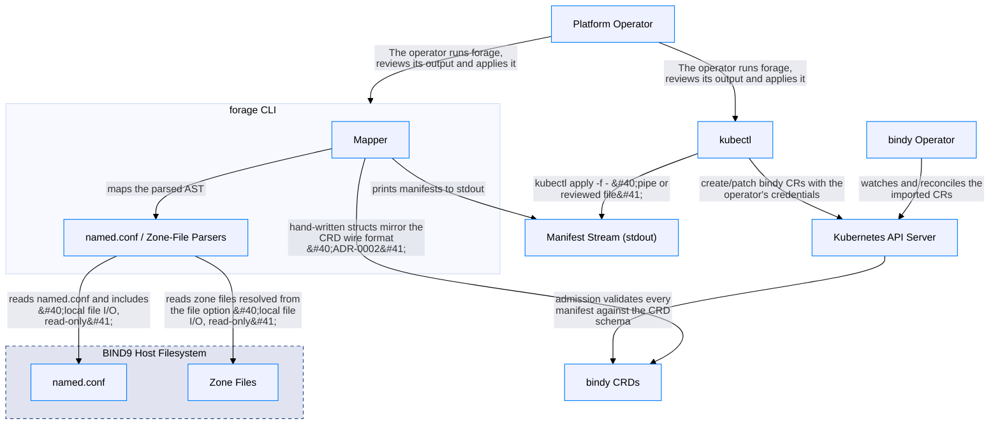

<!--
  Copyright (c) 2025 Erick Bourgeois, firestoned
  SPDX-License-Identifier: Apache-2.0

  GENERATED FILE: DO NOT EDIT.
  Source: calm/forage.architecture.json
  Regenerate with: make calm-docs
-->

# forage: named.conf to bindy CRDs

> Auto-generated from [`calm/forage.architecture.json`](https://github.com/firestoned/forage/blob/main/calm/forage.architecture.json)
> via `make calm-docs`. Edit the CALM model, not this page.

